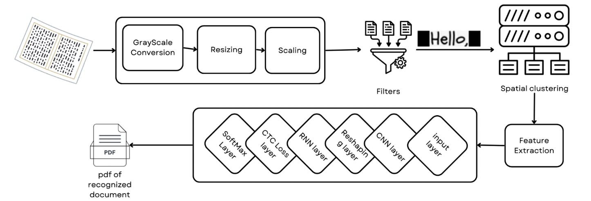
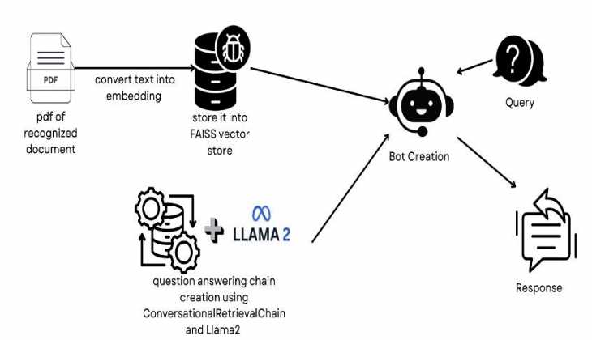
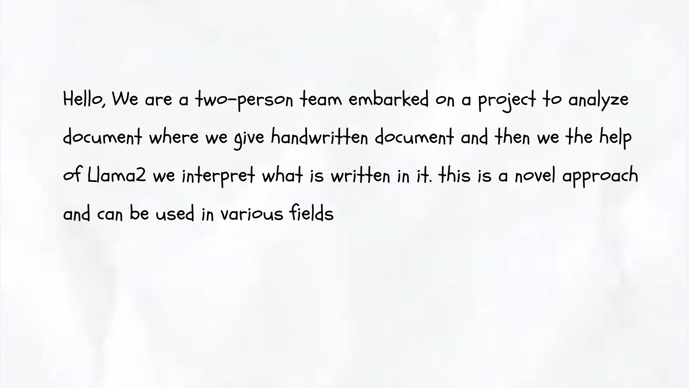
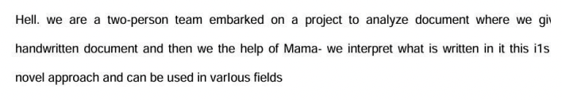
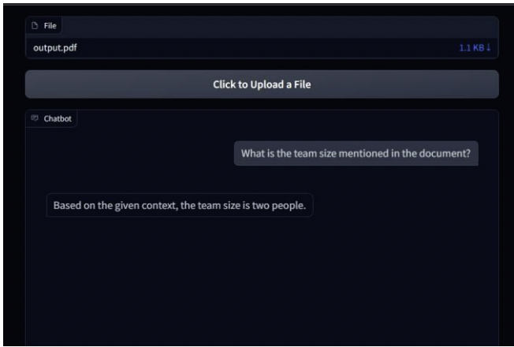

# 🤖 AI-Powered Document-Based Question Answering System  

## 📌 Overview  
This project is an AI-powered **document-based question-answering system** that allows users to upload files, process text into embeddings, and retrieve relevant responses using **ConversationalRetrievalChain** and **Llama2 (CTransformers)**. It leverages **FAISS** for efficient similarity search and retrieval.  

## 🚀 Features  
- 📂 **File Uploading**: Upload PDF or text documents for processing.  
- 🔍 **Data Embedding & Storage**: Converts document text into embeddings and stores them in **FAISS**.  
- 🤖 **Conversational AI**: Uses **Llama2 (CTransformers)** to generate accurate responses.  
- 🛠 **Query Handling**: Users can ask document-based questions and receive contextual answers.  

## 🏗 System Architecture  
Below is the block diagram representing the workflow:  

### 🔹 Handwritten Text Recognition
  
### 🔹 Handwritten Document Interpretation Using Llama2
  

## 📂 Repository Structure  

📦 project_root  
│-- 📂 assets/                 # Stores images & documentation  
│-- 📂 data/                   # Input documents  
│-- 📂 examples/               # Example inputs and outputs  
│-- 📂 vectorstore/db_faiss/   # FAISS vector store  
│-- 📜 app.py                  # Main application script  
│-- 📜 setup.py                # Setup configurations  
│-- 📜 requirements.txt        # Required dependencies  
│-- 📜 index.faiss             # FAISS index file  
│-- 📜 ocr_model_50_epoch.h5   # OCR model file  
│-- 📜 output.pdf              # Sample output document  
│-- 📜 .gitignore              # Git ignore file  
│-- 📜 README.md               # Documentation  

## 🛠 Installation & Setup  

### 1️⃣ Clone the Repository  
```sh
git clone https://github.com/your_username/your_repository.git
cd your_repository
```

### 2️⃣ Install Dependencies  
```sh
pip install -r requirements.txt
```

### 3️⃣ Run the Application  
```sh
python app.py
```

## 📝 Usage  
1. **Upload a document** via the web interface or CLI.  
2. **System processes the document** by embedding text chunks using FAISS.  
3. **Enter a query** related to the document.  
4. **Receive AI-generated responses** powered by Llama2.  

## 🎯 Example Workflow  

1. **Upload Document**: `example.pdf`  
2. **System Stores Embeddings** in FAISS.  
3. **User Query**: "What is the summary of this document?"  
4. **Response**: "The document discusses..."  

## 📸 Screenshots  

### 🔹 File Upload  
  

### 🔹 Text transcribed by OCR with minor errors 
  

### 🔹 Output from the model stored in a PDF format 
  

### 🔹 Response Generation  
  

## 🤝 Contributing  
Contributions are welcome! Please open an issue or submit a pull request.  

